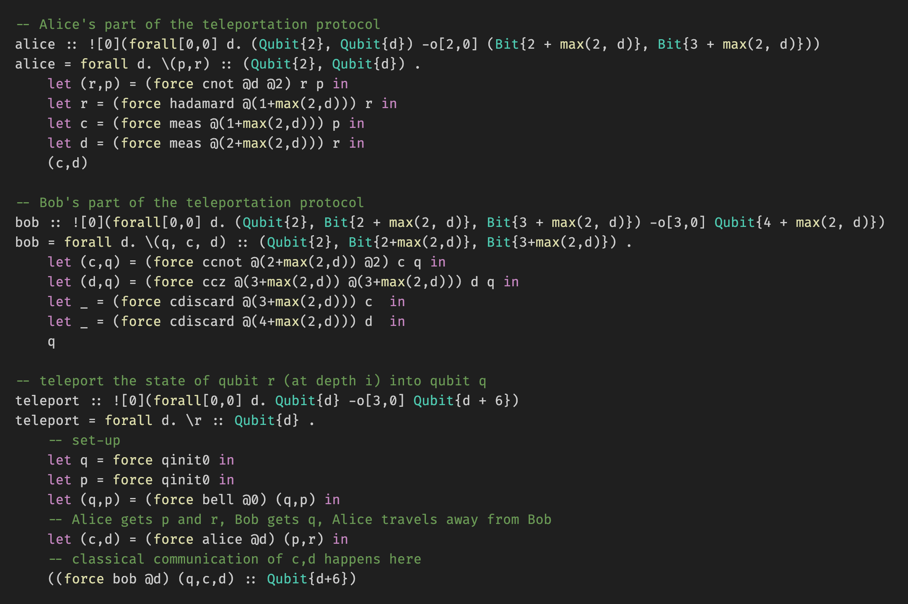

# pqr-syntax-highlighting README

This extension provides syntax highlighting for the Proto-Quipper-R language.

## Features

This extensions provides very basic syntax highlighting for
- Line and block comments
- Types
- Constants
- Primitive operators (e.g. lift, force, fold, ...)
- Control structures (e.g. let-in)

Without highlighting       |  With highlighting
:-------------------------:|:-------------------------:
  |  

## Release Notes

### 1.0.0

Initial release
