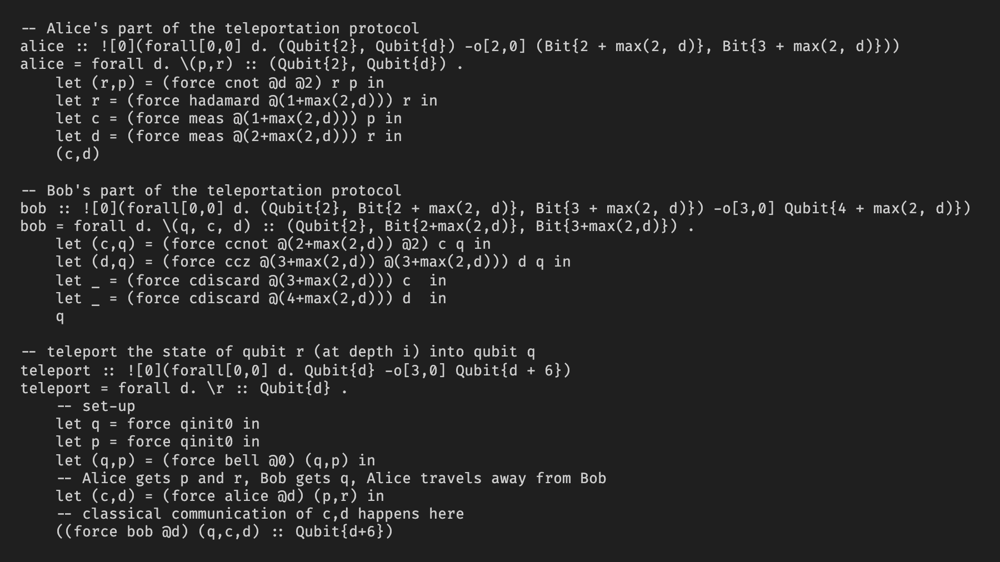

# pq-syntax-highlighting README

This extension provides syntax highlighting for the PQ language.

## Features

This extensions provides very basic syntax highlighting for
- Line and block comments
- Types
- Primitive operators (e.g. lift, force, ...)
- Control structures (e.g. let-in, fold, ...)

Without highlighting       |  With highlighting
:-------------------------:|:-------------------------:
  |  

## Release Notes

### 1.1.0

Rebranded the language as PQ and added support for new syntax:
- Top-level declarations
- Local metric annotations

### 1.0.0

Initial release
